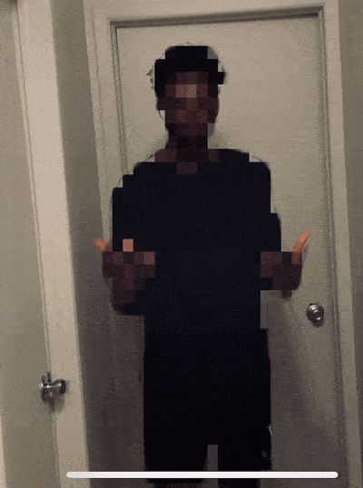

# Blocked

Inspired by Black Mirror's White Christmas episode, this is a proof of concept for the ability to 'block' people, preventing any form of interaction with them by scrambling them out of your senses.

## Requirements
- [NatML 1.0+](https://github.com/natsuite/NatML)
- [NatDevice 1.1+](https://assetstore.unity.com/packages/tools/integration/natdevice-media-device-api-162053)
- [@natsuite/meet-segmentation](https://hub.natsuite.io/predictor/@natsuite/meet-segmentation)

## Supported Platforms
- Android API level 24+ (Android Nougat or newer)
- iOS 13+
- macOS 10.15+
- Windows 10 (64-bit)

## Quick Tips
- Explore more ML models on [NatML Hub](https://hub.natsuite.io).
- See the [NatML documentation](https://docs.natsuite.io/natml).
- Join the [NatSuite community on Discord](https://discord.gg/y5vwgXkz2f).
- Discuss [NatML on Unity Forums](https://forum.unity.com/threads/open-beta-natml-machine-learning-runtime.1109339/).
- Contact us at [hi@natsuite.io](mailto:hi@natsuite.io).

Thank you very much!